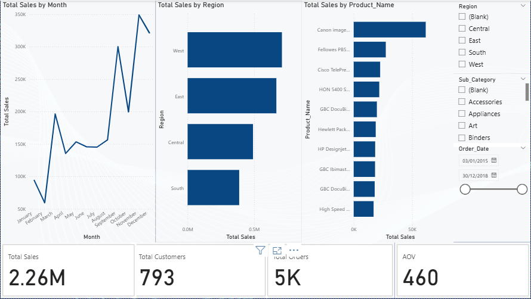

# Sales Analysis (SQL • Excel • Power BI)

An end‑to‑end analytics project on retail/e‑commerce sales: data modeling in MySQL, cleaning & exploration, Excel KPIs, and an interactive Power BI dashboard.

## 🔧 Tech
- **SQL** (MySQL 8)
- **Excel** (PivotTables, Power Query)
- **Power BI** (DAX, interactive filters)

## 📂 Structure
sales-data-analysis/

├─ data/

│ ├─ data_raw/ # source CSVs

│ ├─ data_interim/ # cleaned/joins exported from SQL

│ └─ data_processed/ # final datasets for BI

├─ sql/ # DDL and analysis queries

├─ excel/ # Excel report

├─ powerbi/ # .pbix dashboard

├─ visuals/ # exported PNGs for README

└─ docs/ # notes, decisions, data dictionary

## 🗺️ Roadmap
- [x] Create repo & structure
- [x] Load sample Superstore dataset
- [x] Create MySQL schema & load
- [x] Clean/dedupe & fix dates
- [x] EDA queries
- [x] Excel KPIs + pivots
- [x] Power BI dashboard
- [x] Publish dashboard & screenshots
- [x] Write up insights

## 🔎 Key Insights (v1)
- Region **West** leads revenue; **South** shows fastest growth MoM at 22.95%.
- Top 10 products contribute 10.81% of sales (Pareto effect).
- AOV is $460.42; consider bundles for segments with lower AOV.

